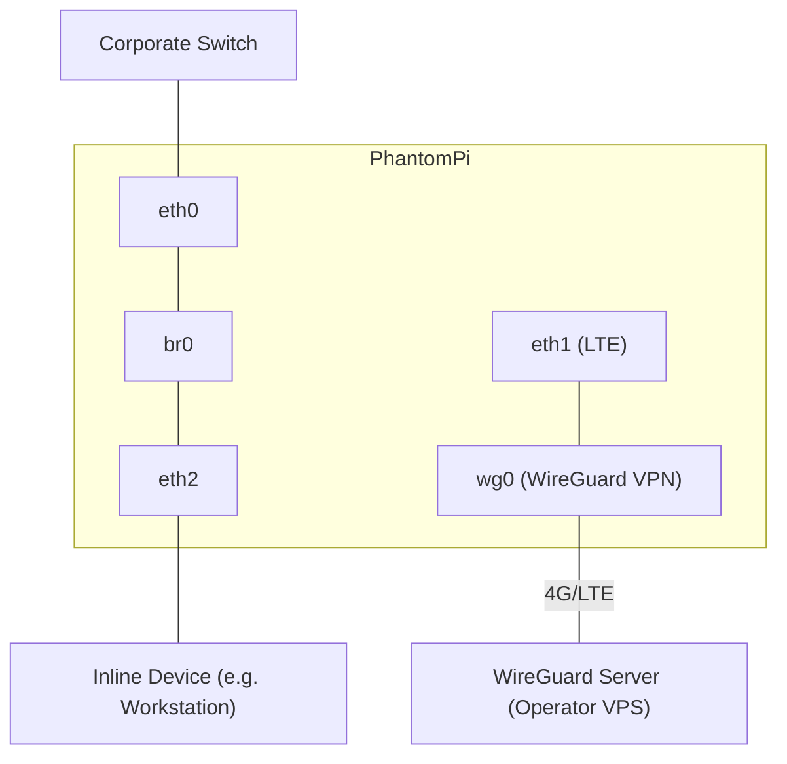

<p align="center">
  
</p>

<h1 align="center">PhantomPi: A Covert Red Team Implant</h1>

<p align="center">
  
  
  
  
</p>

<p align="center">
  <sub><i>Developed during my work at <a href="https://www.inthecyber.com/">InTheCyber Group</a></i></sub>
</p>

<p align="center">
  <a href="#features">Features</a> •
  <a href="#hardware">Hardware</a> •
  <a href="#architecture">Architecture</a> •
  <a href="#installation">Installation</a> •
  <a href="#3d-enclosure">3D Enclosure</a> •
  <a href="#changelog">Changelog</a>
</p>

---

## Overview

**PhantomPi** is a Raspberry Pi-based network implant for red team operations requiring physical access. It positions itself inline between a corporate asset and the network switch, transparently forwarding all traffic while:

- Bypassing 802.1X/NAC by forwarding EAPOL frames
- Spoofing the inline device's identity (IP, MAC, hostname)
- Capturing network traffic and harvesting credentials in real-time
- Maintaining persistent access via 4G/LTE out-of-band channel

> [!NOTE]
> **📖 Technical Deep Dive on Medium**
> 
> [**Part 1**](https://posts.inthecyber.com/phantompi-a-covert-red-team-implant-part-1-8976a72c34d0): Hardware assembly, LTE modem configuration, WireGuard VPN, Resilience measures, Discord C2 bot
> 
> [**Part 2**](https://posts.inthecyber.com/phantompi-a-covert-red-team-implant-part-2-d74493d731ee): Bridge mode, traffic interception, 802.1X/NAC bypass, identity spoofing, 3D-printed enclosure

## Gallery

---

<div align="center">


<br/>

<details>
<summary><b>📸 View full gallery<b></summary>
<br/>

<table width="100%">
  <tr>
    <td width="50%" align="center">
      
    </td>
    <td width="50%" align="center">
      
    </td>
  </tr>
  <tr>
    <td width="50%" align="center">
      
    </td>
    <td width="50%" align="center">
      
    </td>
  </tr>
  <tr>
    <td width="50%" align="center">
      
    </td>
    <td width="50%" align="center">
      
    </td>
  </tr>
</table>

</details>

</div>

## Features

| Capability | Description |
|------------|-------------|
| **Transparent Bridging** | Layer 2 bridge with `group_fwd_mask=8` for 802.1X EAPOL passthrough |
| **Identity Spoofing** | Auto-detection of target IP/MAC via ARP, hostname via LLDP, gateway and DNS |
| **Out-of-Band Control** | 4G/LTE modem (RNDIS) + WireGuard VPN + OpenClaw AI gateway |
| **Traffic Interception** | Continuous packet capture with rolling PCAP storage + credential extraction with webhook push alerts |
| **Resilience** | Hardware watchdog, WireGuard auto-reconnect, hidden WiFi AP fallback |

## Hardware

### Bill of Materials

#### Core Modules
| Component | Link |
|-----------|------|
| Raspberry Pi 4 – Model B | [Amazon](https://amzn.eu/d/08y3z1Lm) |
| Waveshare 4G HAT (SIM7600G-H) | [Amazon](https://www.amazon.it/dp/B0824P4B7M) |
| PoE HAT Module | [Amazon](https://www.amazon.it/dp/B0928ZD7QQ) |
| Witty Pi 4 (RTC & Power Management) | [UUGear](https://www.uugear.com/product/witty-pi-4/) |

#### Networking & Wireless
| Component | Link |
|-----------|------|
| USB-Ethernet Adapter | [Amazon](https://www.amazon.it/dp/B09FDRMZ73) |
| 4G Antenna SMA 6 dBi Omnidirectional | [Amazon](https://www.amazon.it/dp/B0CQYD3SXS) |
| RP-SMA to U.FL Low-Loss Coaxial Cable | [Amazon](https://www.amazon.it/dp/B0C89RPVYQ) |
| EIOTCLUB SIM Card | [Amazon](https://www.amazon.it/dp/B0D7ZKPVH9) |

#### Connectors & Cables
| Component | Link |
|-----------|------|
| Right-Angle Micro USB Connector | [Amazon](https://www.amazon.it/dp/B0C36JV6ST) |
| Ribbon USB Cable – 20 cm | [Amazon](https://www.amazon.it/dp/B0C36K629Z) |
| USB-A Connector | [Amazon](https://www.amazon.it/dp/B0C36JJC33) |
| Right-Angle USB-C to USB-C Cable – 30 cm | [Amazon](https://www.amazon.it/dp/B0DKHGM7FR) |
| Passthrough USB-C Adapter | [Amazon](https://www.amazon.it/dp/B09XDWFYRP) |
| Passthrough Ethernet Adapter | [Amazon](https://www.amazon.it/dp/B0CYGSF5WR) |
| Flexible Ethernet Cables – 25 cm | [Amazon](https://www.amazon.it/dp/B0DBQPZS4R) |

#### Mounting & Build Materials
| Component | Link |
|-----------|------|
| Raspberry Pi Spacer Kit | [Amazon](https://www.amazon.it/dp/B07MN2GY6Y) |
| Brass Hex Spacer M2.5 × 15+6 mm (Male-Female) | [Amazon](https://www.amazon.it/dp/B0BTYP6MCQ) |
| Brass Hex Spacer M2.5 × 16+6 mm (Male-Female) | [Amazon](https://www.amazon.it/dp/B0BTYQF6H8) |
| Self-Tapping Screws – M2 / M2.3 / M2.6 / M3 | [Amazon](https://www.amazon.it/dp/B09NDPGJG1) |
| PLA Filament – 1 Kg | [Amazon](https://amzn.eu/d/0MXtUJm) |
| Portable Case | [Amazon](https://www.amazon.it/dp/B09PRBBH6P) |

### Assembly Instructions

The implant is built by stacking the boards and modules using M2.5 spacers of specific lengths:

| Layer | Spacer Type | Spacer Length |
|-------|-------------|---------------|
| Bottom → Pi 4 | M2.5 Male-Female | 5 mm + 5 mm |
| Pi 4 → PoE HAT | M2.5 Male-Female | 16 mm + 6 mm |
| PoE HAT → 4G HAT | M2.5 Male-Female | 16 mm + 6 mm |
| 4G HAT → Witty Pi 4 | M2.5 Male-Female | 11 mm + 6 mm |
| Witty Pi → Printed Top HAT | M2.5 Female-Female | 11 mm |
| Top Screws on Printed HAT | M2.5 Screws | — |
| Case Cover Screws | M2.6 Screws | — |

> ⚠️ **USB Port Assignment**: The LTE module and USB-to-Ethernet adapter must be connected to specific USB ports to ensure consistent interface naming (`eth1`, `eth2`). See [USB port mapping](https://medium.com/inthecyber-posts/phantompi-a-covert-red-team-implant-part-2-d74493d731ee#0db1) in the Part 2 article.

### Interface Mapping

| Interface | Role |
|-----------|------|
| `eth0` | Corporate network (PoE powered) |
| `eth1` | LTE modem (RNDIS mode) |
| `eth2` | Inline device connection |

## Architecture



### Pivot Backends

PhantomPi keeps transparent bridge mode as the base behavior: traffic from the
inline device continues to cross `br0` and can be captured by the implant. The
active pivot mode is selected in `/opt/implant/config.env`:

```bash
PIVOT_BACKEND="legacy-spoof"
```

Available modes:

| Backend | Behavior | Tradeoff |
|---------|----------|----------|
| `legacy-spoof` | Original `veth0`/`veth1` pivot. `veth1` takes the inline device IP/MAC and legacy ebtables/arptables/iptables rules reduce leaks. | Default and most compatible, but the implant and real device share the same identity. |
| `nft-stateful` | Creates a `phantompi-pivot` namespace with a veth peer enslaved into `br0`. `nft bridge` rewrites implant-owned flows to the inline device IP/MAC and rewrites matching replies back to the namespace. | Avoids assigning the client identity to a root-namespace interface. Keep `PIVOT_ENABLE_ICMP="no"` for transparent client ICMP. |
| `conntrack-bridge` | Assigns `PIVOT_CONNTRACK_IP` to `br0`, enables `br_netfilter`, uses iptables SNAT plus ebtables L2 SNAT, and lets conntrack reverse-NAT replies into the implant stack. | Closest to the NeCr00/NAC-Bypass model. Transparent client traffic remains untouched because L2 SNAT matches the bridge MAC, not the client MAC. |

Common settings:

```bash
PIVOT_SNAT_PORT_RANGE="61000-62000"
PIVOT_ENABLE_ICMP="no"
PIVOT_CONNTRACK_IP="169.254.66.66/16"
PIVOT_CONNTRACK_GW="169.254.66.1"
```

`nft-stateful` and `conntrack-bridge` both use a reserved TCP/UDP source-port
range for implant-owned flows. This reduces but does not mathematically remove
collision risk with the real client. Keep the backend set to `legacy-spoof`
unless the newer mode has been validated on the target kernel and network.

## Installation

> [!IMPORTANT]
> These scripts have been tested only on the exact hardware and software configuration detailed in this repository and in the Medium articles. Other setups may require adjustments.

### Implant (Raspberry Pi)

1. Flash **Kali Linux ARM** onto the Raspberry Pi 4 SD card
2. Clone this repository and fill in the configuration:
   ```bash
   git clone https://github.com/1r0ncut/PhantomPi.git
   cd PhantomPi/implant
   nano setup/init.json          # fill WireGuard, LTE, hotspot, Discord values
   ```
3. Run the setup script:
   ```bash
   sudo bash setup.sh
   ```
4. Reboot the implant:
   ```bash
   sudo reboot
   ```

> Use `sudo bash setup.sh --debug` for verbose output.
>
> To undo everything and re-run from scratch:
> ```bash
> sudo bash setup/reset.sh          # quick reset (keeps WG keys)
> sudo bash setup/reset.sh --full   # full reset (removes everything)
> ```

#### Resulting Filesystem Layout

```
/opt/implant/
├── config.env              # Central configuration
├── api/                    # Flask/Gunicorn HTTPS API (port 8443)
│   ├── routes/             # Standalone route modules
│   ├── certs/              # Self-signed TLS certificate
│   └── venv/               # Python virtual environment
├── scripts/
│   ├── bridge-sync.sh      # Bridge lifecycle (auto create/teardown)
│   ├── traffic-analyzer.py # Scapy-based PCAP credential + subnet analyzer
│   ├── spoof-target.sh     # Identity detection & spoofing
│   ├── wg-keepalive.sh     # VPN auto-reconnect
│   ├── hidden-hotspot.sh   # Emergency WiFi AP
│   ├── modem-config.sh     # LTE modem AT commands
│   └── trigger-lldp.py     # LLDP hostname extraction
├── logs/
│   ├── packet-sniffer/     # Rolling PCAP captures
│   └── traffic-analyzer/   # findings.json + subnet-suggestions.json + state.json
├── services/               # systemd service units
├── timers/                 # systemd timer units
└── wittypi/                # Witty Pi 4 power management + UWI
```

### VPS (Operator Server)

1. Clone this repository on your VPS and fill in the configuration:
   ```bash
   git clone https://github.com/1r0ncut/PhantomPi.git
   cd PhantomPi/vps
   nano setup/init.json          # fill Discord token, guild ID, WireGuard peers
   ```
2. Run the setup script:
   ```bash
   sudo bash setup.sh
   ```
3. Verify:
   ```bash
   wg show
   systemctl status openclaw-gateway.service
   ```

> To undo everything and re-run from scratch:
> ```bash
> sudo bash setup/reset.sh          # quick reset (keeps WG keys)
> sudo bash setup/reset.sh --full   # full reset (removes everything)
> ```

#### Resulting Filesystem Layout

```
/home/openclaw/
├── .openclaw/
│   ├── openclaw.json       # OpenClaw configuration
│   └── .env                # API keys and tokens (600)
├── workspace/
│   ├── AGENTS.md           # Hard rules: output format, multi-implant handling
│   ├── SOUL.md             # PhantomPi context and inner workings
│   └── IDENTITY.md         # Bot persona (PhantomClaw)
├── scripts/
│   └── query-implant.sh    # Universal implant API query script
└── skills/
    ├── implant-status/     # Natural-language status queries
    ├── cred-sniffer/       # Credential analysis & reporting
    ├── bridge-sync/        # Bridge event notifications
    └── pivot/              # Network pivot & Ligolo-ng session management
```

## 3D Enclosure

STL files for the custom 3D-printed case:

| File | Description |
|------|-------------|
| [`phantompi-implant-case.stl`](docs/3d-models/phantompi-implant-case.stl) | Main enclosure (body + cover) |
| [`usb-to-eth-adapter-hat.stl`](docs/3d-models/usb-to-eth-adapter-hat.stl) | USB-to-Ethernet adapter mount |

## Changelog

- **[v1.1](https://github.com/1r0ncut/PhantomPi/releases/tag/v1.1)**: Replaced Discord bot with OpenClaw AI assistant; real-time credential push via webhook, natural-language C2, modular skill system ([Implant API and OpenClaw Skills](docs/skills-and-api.md))
- **[v1.0](https://github.com/1r0ncut/PhantomPi/releases/tag/v1.0)**: Initial release, transparent bridge, 802.1X bypass, identity spoofing, LTE out-of-band C2, Discord bot
